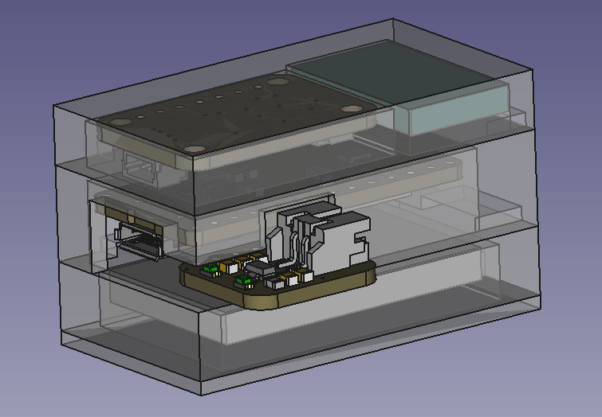

# rocketlogger
A data logger for water rockets

## Hardware
* Adafruit 4481 ItsyBitsy NRF52840
* Adafruit 2652 BMP280 STEMMA QT Altimeter and Pressure
* Generic Bosch BNO055 Acceleration and Attitude Breakout Board
* Adafruit 2124 LiPo Charger Backpack
* Generic 150 mAh LiPo Battery

## Planned Features
* Log altitude, acceleration, heading, ...
* Transfer data after landing via Bluetooth
* Data viewer with derived values like climb speed etc.
* Trigger parachute deployment
* Rocket recovery helper via sound and light
* (Speed logging from ground via audio (Doppler) and light (flashing and long exposure at night)

## First Time Setup
When running the code for the first time on a new board it will complain in the serial monitor about the filesystem missing. To format the flash, simply uncomment the line `format_flash();` in `setup()` and hit 'upload and monitor' in PlatformIO. Confirm the format in the serial monitor, and when done comment the format_flash line out again and re-upload the code to restart the board.